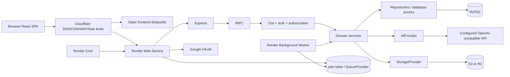
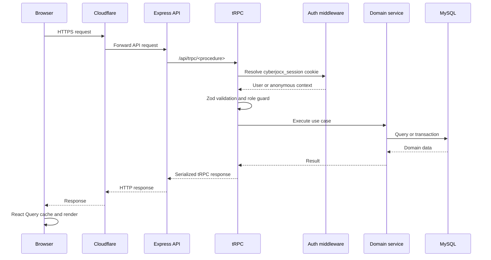
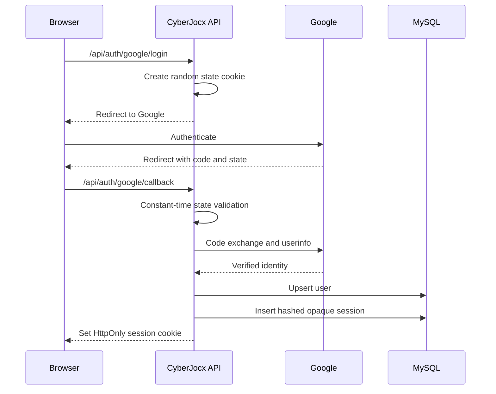
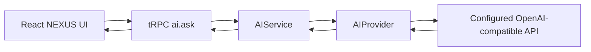
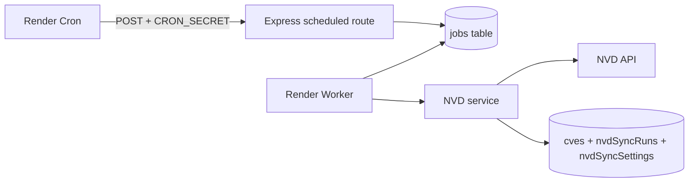

# CyberJocx — Production Architecture

## 1. Target architecture

CyberJocx is a modular monolith. The browser frontend is independently buildable and can be published as static assets behind Cloudflare. The backend remains one Node.js/Express process deployed as a Render Web Service. Background work uses the same codebase through a durable MySQL-backed job queue and an independent worker process.



The repository does not contain provider credentials. Production values are supplied through environment configuration.

## 2. Project structure

```text
client/
  src/
    _core/                 frontend auth hook
    components/            shared UI components
    contexts/              theme context
    hooks/                 reusable browser hooks
    lib/                   tRPC and utility clients
    pages/                 route-level page components
    App.tsx                application composition and route table
    main.tsx               browser entry point
server/
  config/                  validated environment and constants
  core/                    errors, logging, auth, security middleware
  infrastructure/
    ai/                    AIProvider and OpenAI-compatible adapter
    database/              lazy Drizzle client
    queue/                 durable QueueProvider
    storage/               S3/R2-compatible StorageProvider
  modules/
    ai/                    AIService and prompt orchestration
    notifications/         in-app notification service
  _core/                   Express/tRPC/Vite compatibility runtime
  db.ts                    current domain query facade
  googleAuth.ts            application-owned Google OAuth routes
  nvdSync.ts               NVD service, cron handler, and worker job logic
  routers.ts               typed tRPC boundary
  worker.ts                background worker entry point
drizzle/
  schema.ts                logical MySQL schema
  relations.ts             typed Drizzle relations
  *.sql                    explicit non-destructive migrations
render.yaml                Render Web Service, Worker, and Cron definitions
.env.example               environment contract
README.md                  setup and deployment instructions
```

`server/db.ts` remains a compatibility facade for the existing domain query functions. New infrastructure responsibilities have been extracted from it. The next safe incremental step is to move each query group into a domain repository without changing the tRPC contract.

## 3. Frontend architecture

The frontend is React 19 with Vite, React Query, tRPC, Wouter, Radix UI, Tailwind, and superjson. `client/src/main.tsx` creates the query client and sends requests to `${VITE_API_BASE_URL}/api/trpc`. When the variable is empty, same-origin development behavior is preserved.

Google login uses the same public API base through `client/src/const.ts`. No private secret is read by the browser. The only frontend environment values are public API and analytics settings.

`App.tsx` retains the existing product experience and Wouter entry points. The large `Home.tsx` remains the application shell and feature composition point so the migration does not change the product UI. Its feature views continue to use typed tRPC hooks and React Query cache invalidation.

## 4. Backend architecture

`server/_core/index.ts` creates the Express app. The app installs strict origin handling, state-changing request origin validation, bounded body parsers, health endpoints, Google routes, the scheduled NVD endpoint, and the tRPC adapter.

The backend layers are:

```text
HTTP route / tRPC procedure
        ↓
Zod validation and auth middleware
        ↓
Domain service
        ↓
Repository / Drizzle query facade
        ↓
MySQL or provider abstraction
```

The tRPC router still preserves the existing feature namespaces: `auth`, `dashboard`, `profile`, `roadmaps`, `tracks`, `courses`, `cves`, `tools`, `community`, `market`, `malware`, `nvd`, `notifications`, `ai`, and `admin`.

## 5. API and request flow



Explicit HTTP routes are:

| Method | Path | Purpose | Protection |
|---|---|---|---|
| `GET` | `/health` | Liveness | Public |
| `GET` | `/ready` | Database readiness | Public status only |
| `GET` | `/api/auth/google/login` | Start Google OAuth | Rate limited |
| `GET` | `/api/auth/google/callback` | Complete OAuth and create session | OAuth state required |
| `POST` | `/api/scheduled/nvd-sync` | Enqueue NVD synchronization | `CRON_SECRET` required |
| `POST` | `/api/trpc` | Product API transport | Per-procedure guards |

## 6. Authentication

Authentication is owned by CyberJocx. Google OAuth is the external identity provider. The callback validates a cryptographically random state cookie, exchanges the authorization code, fetches verified user information, upserts the local `users` record, and creates an opaque random session token.

Only a SHA-256 token hash is stored in the new `sessions` table. The browser receives the raw token through an HttpOnly cookie named `cyberjocx_session`. `SESSION_COOKIE_SAMESITE`, `SESSION_COOKIE_SECURE`, and `SESSION_COOKIE_DOMAIN` are configurable. The temporary Cloudflare Pages-to-Render topology requires `SameSite=None` and `Secure=true`; same-site deployments can choose a stricter policy. Sessions have an expiration timestamp and a nullable revocation timestamp. Logout revokes the database session and clears the cookie.



## 7. Authorization

Authorization remains centralized at the tRPC procedure layer:

- `publicProcedure` permits anonymous access.
- `protectedProcedure` requires a valid local session.
- `adminProcedure` requires `users.role = admin`.

Object-level checks remain in the procedures and domain operations. For example, profile updates use the authenticated user ID, notification reads require both notification ID and owner ID, and cart removal requires the authenticated user’s cart ID.

## 8. Database architecture

The application uses Drizzle ORM with MySQL. `server/infrastructure/database/client.ts` owns lazy connection initialization. `server/db.ts` delegates connection creation to this client while retaining the existing query API during incremental modularization.

The existing domain tables are preserved. Two additive tables were introduced:

| Table | Purpose |
|---|---|
| `sessions` | Revocable application-owned sessions with expiry and metadata. |
| `jobs` | Durable background jobs with status, attempts, timestamps, payload, and failure information. |

Migration `0007_application_sessions.sql` adds sessions and high-value indexes for progress, quizzes, likes, follows, friend requests, carts, and notifications. Migration `0008_jobs.sql` adds the durable job queue. No existing table is dropped and no existing application data is deleted.

Drizzle relations now cover users/sessions, courses/progress, posts/likes, carts/items, follows, and friend requests. Foreign-key constraints were not added blindly because the existing database may contain legacy orphan rows; the migration path should add them only after a production data audit.

## 9. Storage

Profile media uses `StorageProvider`, implemented by `S3StorageProvider`. The provider accepts S3-compatible endpoint, region, bucket, credentials, and public base URL configuration. Cloudflare R2 is supported by setting the endpoint and provider values; ordinary S3 is also supported.

The server validates data URL MIME types, enforces a decoded 3 MB limit, generates safe random object keys, and never exposes storage credentials to the frontend. There is no application storage proxy route. Existing database URLs must be reviewed and migrated operationally before deleting any legacy objects; no automatic destructive media migration is performed.

## 10. AI

The AI path is:



`server/infrastructure/ai/provider.ts` defines the provider contract and implements configurable chat completions with API key isolation, request timeout, response validation, and normalized errors. `server/modules/ai/service.ts` owns prompt construction, history bounds, safe cybersecurity instructions, and roadmap personalization. The router does not call an external model directly.

Usage metadata is returned by the provider and can be persisted in a future `ai_usage` table for quotas and cost reporting. Rate limiting is configured through environment variables; a Redis-backed limiter can replace the current bounded in-process middleware when multiple API instances are deployed.

## 11. Background jobs and NVD synchronization

The NVD HTTP endpoint does not execute the import. It authenticates an external scheduler using `CRON_SECRET`, inserts a durable `jobs` row, and returns `202` with a job ID.

The Render worker claims queued `nvd-sync` jobs, runs the shared NVD service, records success/failure, and continues polling. NVD requests use a timeout, retries, exponential backoff, a bounded lookback window, and idempotent CVE upserts.



The queue interface is provider-neutral. The checked-in implementation uses MySQL so web and worker processes share durable state. If job volume grows, the same interface can be backed by Redis/BullMQ without changing routers or domain services.

## 12. Notifications

In-app notifications remain in the existing `notifications` table. `server/modules/notifications/service.ts` centralizes broadcast and read-marking behavior. Product content creation can call this service without coupling business logic to an external notification vendor. Email can be added through an `EmailProvider` without changing notification procedures.

## 13. Cloudflare and Render responsibilities

Cloudflare Pages is responsible only for static frontend hosting and public browser configuration. Cloudflare DNS/CDN/WAF/rate limiting can remain at the edge. Render is responsible for the Node Web Service, private MySQL service, Background Worker, and Cron Job. The browser never connects directly to MySQL and never receives backend secrets.

`render.yaml` defines the starting deployment units. Cloudflare Pages or equivalent static hosting should publish `dist/public` and set `VITE_API_BASE_URL` to the public API URL. The Render Web Service runs `dist/index.js`; the worker runs `dist/worker.js`; the scheduled job calls the protected NVD endpoint.

## 14. Environment variables

Configuration is validated centrally in `server/config/env.ts`. Important groups are:

- Application: `NODE_ENV`, `PORT`, `APP_WEB_URL`, `API_BASE_URL`, `CORS_ORIGINS`, `TRUST_PROXY`.
- Database/session: `DATABASE_URL`, `JWT_SECRET`, `SESSION_TTL_MS`, `OWNER_OPEN_ID`.
- Google: `GOOGLE_CLIENT_ID`, `GOOGLE_CLIENT_SECRET`, `GOOGLE_OAUTH_REDIRECT_URI`.
- Storage: `STORAGE_PROVIDER`, `STORAGE_ENDPOINT`, `STORAGE_REGION`, `STORAGE_BUCKET`, `STORAGE_ACCESS_KEY`, `STORAGE_SECRET_KEY`, `STORAGE_PUBLIC_BASE_URL`.
- AI: `AI_API_KEY`, `AI_BASE_URL`, `AI_MODEL`, `AI_VISION_MODEL`, `AI_MAX_TOKENS`, `AI_TIMEOUT_MS`.
- Jobs/NVD: `CRON_SECRET`, `NVD_API_URL`, `NVD_API_KEY`.
- Security/observability: rate-limit variables and `LOG_LEVEL`.
- Public frontend: `VITE_API_BASE_URL`, analytics endpoint and website ID.

Production startup fails clearly when mandatory production variables are missing. Private values are never prefixed with `VITE_`.

## 15. Security model

Security controls introduced or retained include:

- Opaque, hashed, expiring, revocable sessions.
- HttpOnly cookies with deployment-configurable SameSite/Secure/Domain policy; temporary cross-site deployment uses SameSite=None and Secure.
- OAuth state validation using constant-time comparison.
- Strict configured CORS origins with credentials support.
- Origin/Referer validation for state-changing production requests.
- Zod server-side validation.
- Request body limits.
- Per-route in-process rate limiting with configurable limits.
- Cron secret authentication.
- Safe storage key validation and MIME/size checks.
- Secret-safe structured logging.
- No browser access to database, storage, OAuth, cron, or AI secrets.
- Server-side admin and object ownership checks.

For horizontally scaled production, move rate-limit buckets to Redis. For high-volume jobs, use a Redis-backed queue implementation behind `QueueProvider`.

## 16. Graceful shutdown and health

The HTTP process handles `SIGTERM` and `SIGINT` by stopping new connections and closing the server. `/health` is a liveness endpoint. `/ready` checks whether the database client is available and returns `503` when the application is not ready.

The worker also handles `SIGTERM` and `SIGINT` and stops polling. Database, queue, and future Redis clients should be closed from the same lifecycle hooks when those providers are enabled.

## 17. Testing strategy

Vitest runs server tests under Node. Existing tests cover logout behavior, Google callback URL rules, OAuth state encoding/decoding, progress, and NVD contract behavior. The migration adds deterministic application-owned session behavior and avoids live external provider tests.

Recommended next coverage before production cutover includes session expiry/revocation, unauthorized object access, cron-secret failure, queue claim idempotency, storage authorization, AI timeout/provider failure, CORS, CSRF origin rejection, rate limiting, and migration rehearsal against a disposable MySQL database.

## 18. Commands

```bash
pnpm install
pnpm dev
pnpm typecheck
pnpm test
pnpm build
pnpm build:client
pnpm build:server
pnpm build:worker
pnpm start
pnpm worker
pnpm db:generate
pnpm db:migrate
pnpm db:push
```

## 19. Explicit remaining operational steps

The code migration is complete only after these environment-specific actions are performed by the deployment owner:

1. Create Google OAuth credentials and register the production callback URL.
2. Provision MySQL and apply migrations explicitly.
3. Provision S3 or R2 and configure bucket CORS/policy.
4. Set production secrets in Render and public API configuration in the frontend build.
5. Configure Cloudflare DNS, CDN, WAF, and rate limits.
6. Create the Render Web Service, Worker, and Cron resources from `render.yaml`.
7. Audit existing media URLs and migrate legacy objects before removing any old bucket.
8. Replace the MySQL-backed queue with Redis/BullMQ if multiple workers or high job volume are required.
