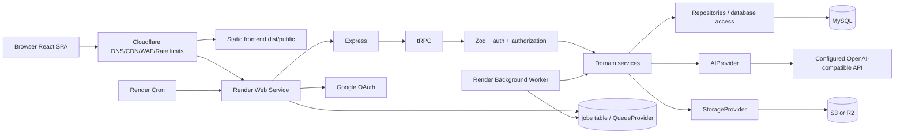
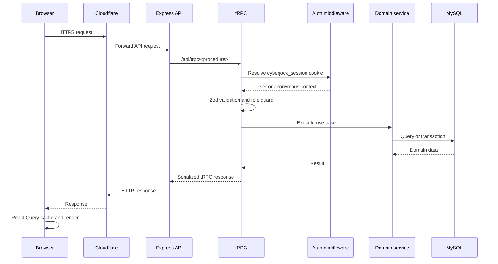
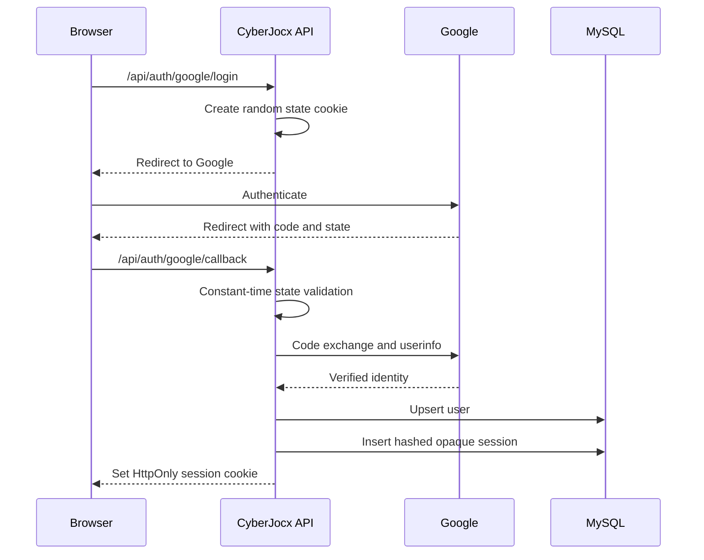
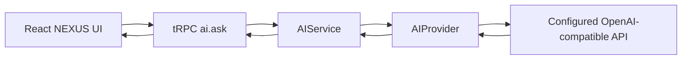
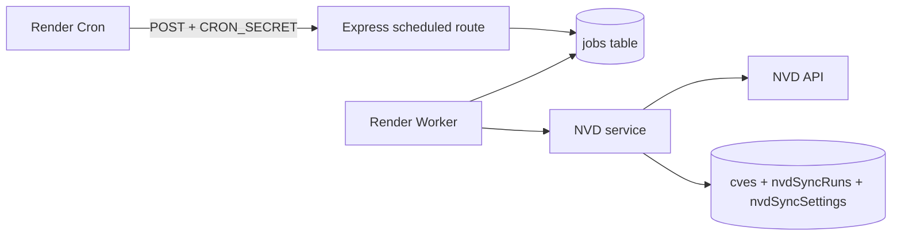

# CyberJocx — Production Architecture

## 1. Target architecture

CyberJocx is a modular monolith. The browser frontend is independently buildable and can be published as static assets behind Cloudflare. The backend remains one Node.js/Express process deployed as a Render Web Service. Background work uses the same codebase through a durable MySQL-backed job queue and an independent worker process.


```mermaid
flowchart LR
  B[Browser React SPA] --> CF[Cloudflare DNS/CDN/WAF/Rate limits]
  CF --> WEB[Static frontend dist/public]
  CF --> API[Render Web Service]
  API --> E[Express]
  E --> T[tRPC]
  T --> V[Zod + auth + authorization]
  V --> S[Domain services]
  S --> R[Repositories / database access]
  R --> DB[(MySQL)]
  S --> AI[AIProvider]
  AI --> MODEL[Configured OpenAI-compatible API]
  S --> ST[StorageProvider]
  ST --> OBJ[(S3 or R2)]
  CRON[Render Cron] --> API
  API --> Q[(jobs table / QueueProvider)]
  WORKER[Render Background Worker] --> Q
  WORKER --> S
  API --> G[Google OAuth]
```

The repository does not contain provider credentials. Production values are supplied through environment configuration.

## 2. Project structure

```text
client/
  src/
    _core/                 frontend auth hook
    components/            shared UI components
    contexts/              theme context
    hooks/                 reusable browser hooks
    lib/                   tRPC and utility clients
    pages/                 route-level page components
    App.tsx                application composition and route table
    main.tsx               browser entry point
server/
  config/                  validated environment and constants
  core/                    errors, logging, auth, security middleware
  infrastructure/
    ai/                    AIProvider and OpenAI-compatible adapter
    database/              lazy Drizzle client
    queue/                 durable QueueProvider
    storage/               S3/R2-compatible StorageProvider
  modules/
    ai/                    AIService and prompt orchestration
    notifications/         in-app notification service
  _core/                   Express/tRPC/Vite compatibility runtime
  db.ts                    current domain query facade
  googleAuth.ts            application-owned Google OAuth routes
  nvdSync.ts               NVD service, cron handler, and worker job logic
  routers.ts               typed tRPC boundary
  worker.ts                background worker entry point
drizzle/
  schema.ts                logical MySQL schema
  relations.ts             typed Drizzle relations
  *.sql                    explicit non-destructive migrations
render.yaml                Render Web Service, Worker, and Cron definitions
.env.example               environment contract
README.md                  setup and deployment instructions
```

`server/db.ts` remains a compatibility facade for the existing domain query functions. New infrastructure responsibilities have been extracted from it. The next safe incremental step is to move each query group into a domain repository without changing the tRPC contract.

## 3. Frontend architecture

The frontend is React 19 with Vite, React Query, tRPC, Wouter, Radix UI, Tailwind, and superjson. `client/src/main.tsx` creates the query client and sends requests to `${VITE_API_BASE_URL}/api/trpc`. When the variable is empty, same-origin development behavior is preserved.

Google login uses the same public API base through `client/src/const.ts`. No private secret is read by the browser. The only frontend environment values are public API and analytics settings.

`App.tsx` retains the existing product experience and Wouter entry points. The large `Home.tsx` remains the application shell and feature composition point so the migration does not change the product UI. Its feature views continue to use typed tRPC hooks and React Query cache invalidation.

## 4. Backend architecture

`server/_core/index.ts` creates the Express app. The app installs strict origin handling, state-changing request origin validation, bounded body parsers, health endpoints, Google routes, the scheduled NVD endpoint, and the tRPC adapter.

The backend layers are:

```text
HTTP route / tRPC procedure
        ↓
Zod validation and auth middleware
        ↓
Domain service
        ↓
Repository / Drizzle query facade
        ↓
MySQL or provider abstraction
```

The tRPC router still preserves the existing feature namespaces: `auth`, `dashboard`, `profile`, `roadmaps`, `tracks`, `courses`, `cves`, `tools`, `community`, `market`, `malware`, `nvd`, `notifications`, `ai`, and `admin`.

## 5. API and request flow


```mermaid
sequenceDiagram
  participant U as Browser
  participant C as Cloudflare
  participant E as Express API
  participant T as tRPC
  participant A as Auth middleware
  participant S as Domain service
  participant D as MySQL

  U->>C: HTTPS request
  C->>E: Forward API request
  E->>T: /api/trpc/<procedure>
  T->>A: Resolve cyberjocx_session cookie
  A-->>T: User or anonymous context
  T->>T: Zod validation and role guard
  T->>S: Execute use case
  S->>D: Query or transaction
  D-->>S: Domain data
  S-->>T: Result
  T-->>E: Serialized tRPC response
  E-->>C: HTTP response
  C-->>U: Response
  U->>U: React Query cache and render
```

Explicit HTTP routes are:

| Method | Path | Purpose | Protection |
|---|---|---|---|
| `GET` | `/health` | Liveness | Public |
| `GET` | `/ready` | Database readiness | Public status only |
| `GET` | `/api/auth/google/login` | Start Google OAuth | Rate limited |
| `GET` | `/api/auth/google/callback` | Complete OAuth and create session | OAuth state required |
| `POST` | `/api/scheduled/nvd-sync` | Enqueue NVD synchronization | `CRON_SECRET` required |
| `POST` | `/api/trpc` | Product API transport | Per-procedure guards |

## 6. Authentication

Authentication is owned by CyberJocx. Google OAuth is the external identity provider. The callback validates a cryptographically random state cookie, exchanges the authorization code, fetches verified user information, upserts the local `users` record, and creates an opaque random session token.

Only a SHA-256 token hash is stored in the new `sessions` table. The browser receives the raw token through an HttpOnly cookie named `cyberjocx_session`. `SESSION_COOKIE_SAMESITE`, `SESSION_COOKIE_SECURE`, and `SESSION_COOKIE_DOMAIN` are configurable. The temporary Cloudflare Pages-to-Render topology requires `SameSite=None` and `Secure=true`; same-site deployments can choose a stricter policy. Sessions have an expiration timestamp and a nullable revocation timestamp. Logout revokes the database session and clears the cookie.


```mermaid
sequenceDiagram
  participant B as Browser
  participant A as CyberJocx API
  participant G as Google
  participant D as MySQL

  B->>A: /api/auth/google/login
  A->>A: Create random state cookie
  A-->>B: Redirect to Google
  B->>G: Authenticate
  G-->>B: Redirect with code and state
  B->>A: /api/auth/google/callback
  A->>A: Constant-time state validation
  A->>G: Code exchange and userinfo
  G-->>A: Verified identity
  A->>D: Upsert user
  A->>D: Insert hashed opaque session
  A-->>B: Set HttpOnly session cookie
```

## 7. Authorization

Authorization remains centralized at the tRPC procedure layer:

- `publicProcedure` permits anonymous access.
- `protectedProcedure` requires a valid local session.
- `adminProcedure` requires `users.role = admin`.

Object-level checks remain in the procedures and domain operations. For example, profile updates use the authenticated user ID, notification reads require both notification ID and owner ID, and cart removal requires the authenticated user’s cart ID.

## 8. Database architecture

The application uses Drizzle ORM with MySQL. `server/infrastructure/database/client.ts` owns lazy connection initialization. `server/db.ts` delegates connection creation to this client while retaining the existing query API during incremental modularization.

The existing domain tables are preserved. Two additive tables were introduced:

| Table | Purpose |
|---|---|
| `sessions` | Revocable application-owned sessions with expiry and metadata. |
| `jobs` | Durable background jobs with status, attempts, timestamps, payload, and failure information. |

Migration `0007_application_sessions.sql` adds sessions and high-value indexes for progress, quizzes, likes, follows, friend requests, carts, and notifications. Migration `0008_jobs.sql` adds the durable job queue. No existing table is dropped and no existing application data is deleted.

Drizzle relations now cover users/sessions, courses/progress, posts/likes, carts/items, follows, and friend requests. Foreign-key constraints were not added blindly because the existing database may contain legacy orphan rows; the migration path should add them only after a production data audit.

## 9. Storage

Profile media uses `StorageProvider`, implemented by `S3StorageProvider`. The provider accepts S3-compatible endpoint, region, bucket, credentials, and public base URL configuration. Cloudflare R2 is supported by setting the endpoint and provider values; ordinary S3 is also supported.

The server validates data URL MIME types, enforces a decoded 3 MB limit, generates safe random object keys, and never exposes storage credentials to the frontend. There is no application storage proxy route. Existing database URLs must be reviewed and migrated operationally before deleting any legacy objects; no automatic destructive media migration is performed.

## 10. AI

The AI path is:


```mermaid
flowchart LR
  UI[React NEXUS UI] --> TRPC[tRPC ai.ask]
  TRPC --> SERVICE[AIService]
  SERVICE --> PROVIDER[AIProvider]
  PROVIDER --> API[Configured OpenAI-compatible API]
  API --> PROVIDER
  PROVIDER --> SERVICE
  SERVICE --> TRPC
  TRPC --> UI
```

`server/infrastructure/ai/provider.ts` defines the provider contract and implements configurable chat completions with API key isolation, request timeout, response validation, and normalized errors. `server/modules/ai/service.ts` owns prompt construction, history bounds, safe cybersecurity instructions, and roadmap personalization. The router does not call an external model directly.

Usage metadata is returned by the provider and can be persisted in a future `ai_usage` table for quotas and cost reporting. Rate limiting is configured through environment variables; a Redis-backed limiter can replace the current bounded in-process middleware when multiple API instances are deployed.

## 11. Background jobs and NVD synchronization

The NVD HTTP endpoint does not execute the import. It authenticates an external scheduler using `CRON_SECRET`, inserts a durable `jobs` row, and returns `202` with a job ID.

The Render worker claims queued `nvd-sync` jobs, runs the shared NVD service, records success/failure, and continues polling. NVD requests use a timeout, retries, exponential backoff, a bounded lookback window, and idempotent CVE upserts.


```mermaid
flowchart LR
  C[Render Cron] -->|POST + CRON_SECRET| E[Express scheduled route]
  E --> Q[(jobs table)]
  W[Render Worker] --> Q
  W --> N[NVD service]
  N --> API[NVD API]
  N --> D[(cves + nvdSyncRuns + nvdSyncSettings)]
```

The queue interface is provider-neutral. The checked-in implementation uses MySQL so web and worker processes share durable state. If job volume grows, the same interface can be backed by Redis/BullMQ without changing routers or domain services.

## 12. Notifications

In-app notifications remain in the existing `notifications` table. `server/modules/notifications/service.ts` centralizes broadcast and read-marking behavior. Product content creation can call this service without coupling business logic to an external notification vendor. Email can be added through an `EmailProvider` without changing notification procedures.

## 13. Cloudflare and Render responsibilities

Cloudflare Pages is responsible only for static frontend hosting and public browser configuration. Cloudflare DNS/CDN/WAF/rate limiting can remain at the edge. Render is responsible for the Node Web Service, private MySQL service, Background Worker, and Cron Job. The browser never connects directly to MySQL and never receives backend secrets.

`render.yaml` defines the starting deployment units. Cloudflare Pages or equivalent static hosting should publish `dist/public` and set `VITE_API_BASE_URL` to the public API URL. The Render Web Service runs `dist/index.js`; the worker runs `dist/worker.js`; the scheduled job calls the protected NVD endpoint.

## 14. Environment variables

Configuration is validated centrally in `server/config/env.ts`. Important groups are:

- Application: `NODE_ENV`, `PORT`, `APP_WEB_URL`, `API_BASE_URL`, `CORS_ORIGINS`, `TRUST_PROXY`.
- Database/session: `DATABASE_URL`, `JWT_SECRET`, `SESSION_TTL_MS`, `OWNER_OPEN_ID`.
- Google: `GOOGLE_CLIENT_ID`, `GOOGLE_CLIENT_SECRET`, `GOOGLE_OAUTH_REDIRECT_URI`.
- Storage: `STORAGE_PROVIDER`, `STORAGE_ENDPOINT`, `STORAGE_REGION`, `STORAGE_BUCKET`, `STORAGE_ACCESS_KEY`, `STORAGE_SECRET_KEY`, `STORAGE_PUBLIC_BASE_URL`.
- AI: `AI_API_KEY`, `AI_BASE_URL`, `AI_MODEL`, `AI_VISION_MODEL`, `AI_MAX_TOKENS`, `AI_TIMEOUT_MS`.
- Jobs/NVD: `CRON_SECRET`, `NVD_API_URL`, `NVD_API_KEY`.
- Security/observability: rate-limit variables and `LOG_LEVEL`.
- Public frontend: `VITE_API_BASE_URL`, analytics endpoint and website ID.

Production startup fails clearly when mandatory production variables are missing. Private values are never prefixed with `VITE_`.

## 15. Security model

Security controls introduced or retained include:

- Opaque, hashed, expiring, revocable sessions.
- HttpOnly cookies with deployment-configurable SameSite/Secure/Domain policy; temporary cross-site deployment uses SameSite=None and Secure.
- OAuth state validation using constant-time comparison.
- Strict configured CORS origins with credentials support.
- Origin/Referer validation for state-changing production requests.
- Zod server-side validation.
- Request body limits.
- Per-route in-process rate limiting with configurable limits.
- Cron secret authentication.
- Safe storage key validation and MIME/size checks.
- Secret-safe structured logging.
- No browser access to database, storage, OAuth, cron, or AI secrets.
- Server-side admin and object ownership checks.

For horizontally scaled production, move rate-limit buckets to Redis. For high-volume jobs, use a Redis-backed queue implementation behind `QueueProvider`.

## 16. Graceful shutdown and health

The HTTP process handles `SIGTERM` and `SIGINT` by stopping new connections and closing the server. `/health` is a liveness endpoint. `/ready` checks whether the database client is available and returns `503` when the application is not ready.

The worker also handles `SIGTERM` and `SIGINT` and stops polling. Database, queue, and future Redis clients should be closed from the same lifecycle hooks when those providers are enabled.

## 17. Testing strategy

Vitest runs server tests under Node. Existing tests cover logout behavior, Google callback URL rules, OAuth state encoding/decoding, progress, and NVD contract behavior. The migration adds deterministic application-owned session behavior and avoids live external provider tests.

Recommended next coverage before production cutover includes session expiry/revocation, unauthorized object access, cron-secret failure, queue claim idempotency, storage authorization, AI timeout/provider failure, CORS, CSRF origin rejection, rate limiting, and migration rehearsal against a disposable MySQL database.

## 18. Commands

```bash
pnpm install
pnpm dev
pnpm typecheck
pnpm test
pnpm build
pnpm build:client
pnpm build:server
pnpm build:worker
pnpm start
pnpm worker
pnpm db:generate
pnpm db:migrate
pnpm db:push
```

## 19. Explicit remaining operational steps

The code migration is complete only after these environment-specific actions are performed by the deployment owner:

1. Create Google OAuth credentials and register the production callback URL.
2. Provision MySQL and apply migrations explicitly.
3. Provision S3 or R2 and configure bucket CORS/policy.
4. Set production secrets in Render and public API configuration in the frontend build.
5. Configure Cloudflare DNS, CDN, WAF, and rate limits.
6. Create the Render Web Service, Worker, and Cron resources from `render.yaml`.
7. Audit existing media URLs and migrate legacy objects before removing any old bucket.
8. Replace the MySQL-backed queue with Redis/BullMQ if multiple workers or high job volume are required.


---

# 39. Hybrid Lab & Challenge Architecture

CyberJocx should use a **hybrid execution model** rather than forcing every exercise into a full isolated environment.

The rule is:

> **Use the cheapest safe execution model that still provides the required learning experience.**

There are two primary execution modes.

## 39.1 Lightweight Link + Token Challenges

Use this mode for exercises that do not require arbitrary code execution, shell access, network interaction, or exploitation of a live target.

Typical examples:

- Basic security exercises
- Knowledge-based challenges
- Simple CTF challenges
- Static analysis questions
- Token discovery challenges
- Guided exercises
- Beginner reconnaissance exercises
- Web/content puzzles

Flow:

```text
User
 ↓
Open Challenge
 ↓
CyberJocx Challenge URL
 ↓
Solve Task
 ↓
Find Token / Flag
 ↓
Submit Flag
 ↓
Backend Validation
 ↓
XP + Progress + Skill Evidence
```

Example:

```text
https://lab.cyberjocx.com/challenge/<challenge-id>
```

The challenge URL should not expose the secret flag in frontend JavaScript.

The server should validate submissions.

## 39.2 Isolated Lab Environments

Use isolated environments whenever the exercise requires actual execution, exploitation, shell access, network interaction, or potentially dangerous behavior.

Examples:

- SQL Injection against a real vulnerable application
- XSS against a target application
- API security testing
- SSRF
- Command Injection
- Linux privilege escalation
- Network exploitation
- Active Directory
- Malware analysis
- Reverse engineering
- Vulnerability research
- Full penetration-testing scenarios

Flow:

```text
User
 ↓
Start Lab
 ↓
Authorization
 ↓
Lab Manager
 ↓
Create Ephemeral Instance
 ↓
Apply Resource + Network Limits
 ↓
Return Target URL / IP / Credentials
 ↓
User Performs Task
 ↓
Submit Flag / Token
 ↓
Server-side Validation
 ↓
Record Evidence
 ↓
Award Progress / XP / Skill Evidence
 ↓
Reset / Suspend / Destroy Instance
```

---

# 40. Hybrid Lab Decision Matrix

| Exercise | Execution Model |
|---|---|
| Quiz | No environment |
| Basic exercise | Link + Token |
| Static challenge | Link + Token |
| Simple CTF | Link + Flag |
| Knowledge challenge | Link + Token |
| SQL Injection | Isolated Lab |
| XSS | Isolated Lab |
| API Security | Isolated Lab |
| SSRF | Isolated Lab |
| Command Injection | Isolated Lab |
| Linux Privilege Escalation | Isolated Lab |
| Windows / AD | Isolated Environment |
| Malware Analysis | Isolated Sandbox |
| Reverse Engineering | Isolated Environment |
| Network Pentesting | Isolated Environment |
| Full Pentest Scenario | Isolated Environment |

This keeps infrastructure costs under control while preserving real hands-on practice.

---

# 41. Secure Flag / Token Validation

Never place real challenge secrets directly inside frontend code.

Avoid:

```ts
const flag = "CYBERJOCX{secret}";
```

because frontend JavaScript can be inspected by the learner.

Instead:

```text
Challenge
   ↓
Server-side Secret / Validator
   ↓
User Submission
   ↓
Validation
   ↓
Result
```

For isolated labs, the secret can exist inside the lab environment or be validated by a dedicated server-side validator.

For lightweight challenges, the backend should own the expected answer or a secure representation of it.

---

# 42. Challenge Validation Model

A generic challenge should expose a server-side validation contract:

```text
Challenge
├── id
├── type
├── difficulty
├── points
├── validation_mode
├── flag_policy
├── hints
└── skill_links
```

Possible validation modes:

```text
STATIC_FLAG
SERVER_VALIDATOR
LAB_FLAG
AUTOMATED_TEST
PROJECT_CHECK
```

The user-facing API should not expose the expected flag.

Submission flow:

```text
POST /challenge/:id/submit
          ↓
Authenticate
          ↓
Authorize
          ↓
Validate input
          ↓
Load challenge
          ↓
Execute safe validator
          ↓
Record submission
          ↓
If correct:
    Progress
    XP
    Skill Evidence
    Achievement
          ↓
Return result
```

---

# 43. Lab Isolation Requirements

Every executable lab must have a security boundary.

Minimum controls:

- CPU limits
- Memory limits
- Disk limits
- Process limits
- Time-to-live
- Network isolation
- Explicit exposed ports
- Non-root execution where possible
- Read-only filesystem where possible
- Dropped Linux capabilities
- No host filesystem mounts
- No Docker socket exposure to learners
- Instance ownership checks
- Automatic cleanup
- Audit logging
- Abuse/rate controls

The main CyberJocx API must never execute arbitrary learner commands.

Learners interact with the isolated lab, not with the host.

---

# 44. Lab Instance Lifecycle

```text
REQUESTED
    ↓
PROVISIONING
    ↓
READY
    ↓
RUNNING
    ↓
COMPLETED / EXPIRED
    ↓
CLEANUP
    ↓
DESTROYED
```

Possible recovery path:

```FAILED_PROVISIONING
        ↓
RETRY
        ↓
PROVISIONING
```

Lab instances should have a hard TTL so abandoned environments do not consume resources indefinitely.

---

# 45. Cost Optimization

Do not create a Docker environment for every action.

Use the following strategy:

```text
Low Complexity
    ↓
Link + Token

Medium Complexity
    ↓
Shared / lightweight challenge runtime

High Complexity
    ↓
Ephemeral isolated container

Very High Complexity
    ↓
Dedicated isolated compute
```

This allows CyberJocx to support a large number of lightweight challenges while reserving compute resources for exercises that actually need them.

Future optimization can include:

- Warm container pools
- Image caching
- Snapshot/restore
- Auto-scaling lab workers
- Per-track lab pools
- Dedicated lab nodes
- Kubernetes when usage justifies it

---

# 46. Unified Challenge Object

Courses, labs and CTFs should not become completely separate systems.

A common challenge model can connect them:

```text
Learning Node
     │
     ├── Lesson
     ├── Quiz
     ├── Challenge
     │     ├── Link + Token
     │     └── Isolated Lab
     ├── CTF
     └── Project
```

This means the same challenge can be referenced from:

- A course
- A roadmap
- A lab
- A CTF event
- A skill
- A project
- A certification requirement

The content relationship should be data-driven rather than hard-coded into frontend pages.

---

# 47. Example CyberJocx Learning Flow

Example: SQL Injection.

```text
Track: Junior Pentester
        ↓
Module: Web Security
        ↓
Lesson: SQL Injection
        ↓
Quiz
        ↓
Guided Challenge
        │
        └── Link + Token
        ↓
Practical SQLi Lab
        │
        └── Isolated Docker Environment
        ↓
SQLi CTF Challenge
        │
        └── Flag Submission
        ↓
Mini Project
        │
        └── Secure Login API
        ↓
Assessment
        ↓
Skill Evidence:
    SQL Injection
    Web Security
    Authentication Security
```

This is the intended CyberJocx learning loop.

---

# 48. Recommended Product Rule

The platform should answer one question for every practical activity:

> **Does this activity need a real execution environment?**

If **No**:

```text
Challenge URL → Solve → Submit Token
```

If **Yes**:

```text
Start Lab → Isolated Environment → Solve → Submit Flag
```

Both models ultimately feed the same systems:

```text
Submission
   ↓
Progress
   ↓
Skill Evidence
   ↓
XP / Achievement
   ↓
Portfolio / Certificate
```

This keeps the user experience unified even though the infrastructure behind different exercises is different.

---

# 49. Final Lab Architecture

```text
                    CYBERJOCX PRACTICE ENGINE
                              │
                ┌─────────────┴─────────────┐
                │                           │
        LIGHTWEIGHT CHALLENGES        ISOLATED LABS
                │                           │
        Link + Token/Flag             Lab Manager
                │                           │
                │                    Ephemeral Container
                │                           │
                │                    Network Isolation
                │                           │
                │                    Resource Limits
                │                           │
                └─────────────┬─────────────┘
                              │
                       Submission API
                              │
                       Server Validator
                              │
                ┌─────────────┼─────────────┐
                │             │             │
             Progress         XP        Skill Evidence
                │             │             │
                └─────────────┼─────────────┘
                              │
                         Portfolio
```

This hybrid model is the official target for CyberJocx practice infrastructure.


---

# 50. Complete CyberJocx System Map

> This is the **single visual reference** for developers joining CyberJocx.
>
> The purpose of this diagram is to show **what connects to what, where responsibilities live, where data flows, and where security boundaries exist**.
>
> A developer should read this diagram together with the sections above before changing architecture, adding a module, or creating a new infrastructure dependency.

## 50.1 Complete Platform Architecture


```mermaid
flowchart TB

    %% =========================================================
    %% USERS / CLIENTS
    %% =========================================================

    U[Users / Learners]
    ADM[Admins / Instructors]
    DEV[Developers]

    U --> WEB
    ADM --> WEB
    DEV --> GH

    %% =========================================================
    %% EDGE / FRONTEND
    %% =========================================================

    subgraph EDGE["PUBLIC EDGE"]
        DNS[cyberjocx.com]
        CDN[Cloudflare CDN / WAF / DNS]
        WEB[CyberJocx Web App<br/>React + TypeScript + Vite]
    end

    DNS --> CDN
    CDN --> WEB

    WEB --> API

    %% =========================================================
    %% FRONTEND
    %% =========================================================

    subgraph FRONTEND["FRONTEND APPLICATION"]
        WEB
        ROUTER[App Router]
        FEATURES[Feature Modules<br/>Auth / Learning / Labs / CTF / AI / Community / Projects / Career / Admin]
        UI[Shared UI Components]
        STATE[Client State / Hooks]
        HTTP[tRPC / API Client]
    end

    WEB --> ROUTER
    ROUTER --> FEATURES
    FEATURES --> UI
    FEATURES --> STATE
    FEATURES --> HTTP
    HTTP --> API

    %% =========================================================
    %% API
    %% =========================================================

    subgraph API_LAYER["CYBERJOCX API - MODULAR MONOLITH"]
        API[Express API + tRPC]

        subgraph CORE["Core"]
            AUTH[Authentication]
            RBAC[Authorization / RBAC]
            VALID[Validation]
            ERR[Error Handling]
            LOG[Logging]
            SEC[Security Middleware]
        end

        subgraph MODULES["Business Modules"]
            USERS[Users]
            LEARN[Learning]
            ROADMAP[Roadmaps]
            COURSES[Courses]
            QUIZ[Quizzes]
            LABS[Labs]
            CTF[CTF]
            SKILLS[Skills]
            PROGRESS[Progress]
            GAME[Gamification]
            PROJECTS[Projects]
            COMMUNITY[Community]
            AI[NEXUS AI]
            CVE[CVE Intelligence]
            NOTIFY[Notifications]
            PAY[Payments]
            PORTFOLIO[Portfolio]
            CERT[Certificates]
            ADMIN[Admin]
        end

        subgraph APIINFRA["API Infrastructure"]
            DBADAPTER[Database Adapter]
            CACHEADAPTER[Cache Adapter]
            QUEUEADAPTER[Queue Adapter]
            STORAGEADAPTER[Storage Adapter]
            AIGATEWAY[AI Gateway]
            EMAIL[Email Provider]
        end
    end

    API --> AUTH
    API --> RBAC
    API --> VALID
    API --> ERR
    API --> LOG
    API --> SEC

    API --> USERS
    API --> LEARN
    API --> ROADMAP
    API --> COURSES
    API --> QUIZ
    API --> LABS
    API --> CTF
    API --> SKILLS
    API --> PROGRESS
    API --> GAME
    API --> PROJECTS
    API --> COMMUNITY
    API --> AI
    API --> CVE
    API --> NOTIFY
    API --> PAY
    API --> PORTFOLIO
    API --> CERT
    API --> ADMIN

    USERS --> DBADAPTER
    LEARN --> DBADAPTER
    ROADMAP --> DBADAPTER
    COURSES --> DBADAPTER
    QUIZ --> DBADAPTER
    LABS --> DBADAPTER
    CTF --> DBADAPTER
    SKILLS --> DBADAPTER
    PROGRESS --> DBADAPTER
    GAME --> DBADAPTER
    PROJECTS --> DBADAPTER
    COMMUNITY --> DBADAPTER
    CVE --> DBADAPTER
    NOTIFY --> DBADAPTER
    PAY --> DBADAPTER
    PORTFOLIO --> DBADAPTER
    CERT --> DBADAPTER
    ADMIN --> DBADAPTER

    %% =========================================================
    %% DATA
    %% =========================================================

    subgraph DATA["DATA LAYER"]
        MYSQL[(MySQL)]
        REDIS[(Redis)]
        OBJECT[(Object Storage<br/>Cloudflare R2 / S3)]
    end

    DBADAPTER --> MYSQL
    CACHEADAPTER --> REDIS
    STORAGEADAPTER --> OBJECT

    %% =========================================================
    %% ASYNC
    %% =========================================================

    QUEUE[Redis Queue / Job Broker]

    QUEUEADAPTER --> QUEUE

    subgraph WORKERS["BACKGROUND EXECUTION"]
        WORKER[CyberJocx Worker]
        SCHED[Scheduler]
        LABWORKER[Lab Jobs]
        AIWORKER[AI Jobs]
        CVEWORKER[CVE / Content Jobs]
        EMAILWORKER[Notification / Email Jobs]
    end

    QUEUE --> WORKER
    SCHED --> QUEUE
    WORKER --> LABWORKER
    WORKER --> AIWORKER
    WORKER --> CVEWORKER
    WORKER --> EMAILWORKER

    %% =========================================================
    %% LAB SYSTEM
    %% =========================================================

    subgraph PRACTICE["PRACTICE ENGINE"]
        CHALLENGE[Challenge Engine]
        VALIDATOR[Flag / Token Validator]
        LABMANAGER[Lab Manager]
        INSTANCE[Ephemeral Lab Instance]
        TARGET[Target App / VM / Service]
    end

    LABS --> CHALLENGE
    CTF --> CHALLENGE
    CHALLENGE --> VALIDATOR
    LABS --> LABMANAGER
    LABMANAGER --> INSTANCE
    INSTANCE --> TARGET

    LABWORKER --> LABMANAGER
    VALIDATOR --> DBADAPTER

    INSTANCE -.->|isolated network| TARGET

    LABMANAGER -.->|NO direct learner access to host| HOSTSEC[Host Security Boundary]

    %% =========================================================
    %% NEXUS AI
    %% =========================================================

    subgraph NEXUS["NEXUS AI"]
        AIGW[AI Gateway / Model Router]
        CONTEXT[Context Builder]
        RAG[RAG / Knowledge Retrieval]
        PROMPT[Prompt / Policy Layer]
        TOOLS[Controlled AI Tools]
    end

    AI --> AIGW
    AIGATEWAY --> AIGW
    AIGW --> CONTEXT
    CONTEXT --> RAG
    CONTEXT --> PROMPT
    AIGW --> TOOLS

    subgraph PROVIDERS["AI PROVIDERS"]
        GEMINI[Google Gemini]
        GROQ[Groq]
        OPENAI[OpenAI]
        ANTHROPIC[Anthropic]
        XAI[xAI / Grok]
    end

    AIGW --> GEMINI
    AIGW --> GROQ
    AIGW --> OPENAI
    AIGW --> ANTHROPIC
    AIGW --> XAI

    RAG --> OBJECT
    RAG --> MYSQL

    %% =========================================================
    %% CYBER INTELLIGENCE
    %% =========================================================

    subgraph INTEL["SECURITY KNOWLEDGE"]
        CVEFEED[CVE Sources]
        CWE[CWE]
        OWASP[OWASP]
        DOCS[CyberJocx Internal Docs]
        CONTENT[Courses / Labs / Writeups]
    end

    CVEFEED --> CVEWORKER
    CWE --> CVEWORKER
    OWASP --> CVEWORKER
    DOCS --> RAG
    CONTENT --> RAG
    CVEWORKER --> MYSQL
    CVE --> RAG

    %% =========================================================
    %% EXTERNAL SERVICES
    %% =========================================================

    subgraph EXTERNAL["EXTERNAL SERVICES"]
        EMAILP[Email Provider]
        PAYMENT[Payment Provider]
        OAUTH[OAuth Providers]
    end

    EMAIL --> EMAILP
    PAY --> PAYMENT
    AUTH --> OAUTH

    %% =========================================================
    %% OBSERVABILITY
    %% =========================================================

    subgraph OBS["OBSERVABILITY & OPERATIONS"]
        METRICS[Metrics]
        TRACING[Tracing]
        AUDIT[Audit Logs]
        ALERTS[Alerts]
        LOGSTORE[Log Storage]
    end

    LOG --> LOGSTORE
    SEC --> AUDIT
    AUTH --> AUDIT
    LABMANAGER --> AUDIT
    API --> METRICS
    WORKER --> METRICS
    LABMANAGER --> METRICS
    METRICS --> ALERTS
    API --> TRACING
    WORKER --> TRACING

    %% =========================================================
    %% CI/CD
    %% =========================================================

    subgraph DELIVERY["SOURCE CONTROL & CI/CD"]
        GH[GitHub Repository]
        ACTIONS[GitHub Actions]
        TESTS[Automated Tests]
        BUILD[Build]
        DOCKER[Docker Images]
        DEPLOY[Deployment]
    end

    GH --> ACTIONS
    ACTIONS --> TESTS
    TESTS --> BUILD
    BUILD --> DOCKER
    DOCKER --> DEPLOY
    DEPLOY --> WEB
    DEPLOY --> API
    DEPLOY --> WORKER
    DEPLOY --> LABMANAGER

    %% =========================================================
    %% INFRASTRUCTURE
    %% =========================================================

    subgraph RUNTIME["RUNTIME"]
        FEHOST[Cloudflare Pages / CDN]
        APIHOST[Docker Host / Render / VPS]
        LABHOST[Dedicated Lab Host / VM]
        DBHOST[Managed MySQL]
        REDISHOST[Managed Redis]
    end

    DEPLOY --> FEHOST
    DEPLOY --> APIHOST
    DEPLOY --> LABHOST
    MYSQL --> DBHOST
    REDIS --> REDISHOST

    WEB --> FEHOST
    API --> APIHOST
    WORKER --> APIHOST
    LABMANAGER --> LABHOST

    %% =========================================================
    %% SECURITY BOUNDARY
    %% =========================================================

    U -.->|HTTPS only| CDN
    CDN -.->|HTTPS| API
    API -.->|private network / credentials| MYSQL
    API -.->|private network / credentials| REDIS
    API -.->|signed access| OBJECT

```

---

## 50.2 End-to-End Request Flow

Every normal user request should conceptually follow:

```text
USER
 │
 │ HTTPS
 ▼
Cloudflare
 │
 ▼
React Frontend
 │
 │ tRPC / API
 ▼
Express + tRPC API
 │
 ├── Authentication
 ├── Authorization
 ├── Validation
 ├── Business Module
 │
 ├──────────────► MySQL
 │
 ├──────────────► Redis
 │
 ├──────────────► Object Storage
 │
 └──────────────► Queue
                       │
                       ▼
                    Worker
                       │
             ┌─────────┼─────────┐
             ▼         ▼         ▼
          AI Jobs   Lab Jobs   CVE Jobs
```

---

## 50.3 Learning Data Flow

```text
ROADMAP
   │
   ▼
COURSE
   │
   ▼
LESSON
   │
   ▼
QUIZ / CHALLENGE
   │
   ├───────────────┐
   │               │
   ▼               ▼
TOKEN CHALLENGE   ISOLATED LAB
   │               │
   └───────┬───────┘
           ▼
      SUBMISSION
           │
           ▼
       VALIDATOR
           │
           ▼
        PROGRESS
           │
      ┌────┼─────────┐
      ▼    ▼         ▼
     XP   SKILL     ACHIEVEMENT
      │    EVIDENCE      │
      └────┼─────────────┘
           ▼
       PORTFOLIO
           │
           ▼
      CERTIFICATION
```

---

## 50.4 NEXUS AI Data Flow

```text
USER
 │
 ▼
NEXUS UI
 │
 ▼
NEXUS API
 │
 ▼
AI Gateway
 │
 ├── Authentication / Authorization
 ├── Rate Limit
 ├── Safety / Policy
 ├── Context Builder
 │
 ├──────────────► User Context
 ├──────────────► Course Context
 ├──────────────► Lab Context
 ├──────────────► CTF Context
 ├──────────────► CVE Context
 └──────────────► RAG
                       │
                       ▼
                  Model Router
                       │
        ┌──────────────┼──────────────┐
        ▼              ▼              ▼
     Gemini          Groq          OpenAI
        │              │              │
        └──────────────┼──────────────┘
                       ▼
                    Response
                       │
                       ▼
                 NEXUS UI
```

---

## 50.5 Lab Security Boundary

```text
                         PUBLIC INTERNET
                                │
                                ▼
                         Cloudflare / API
                                │
                                ▼
                         CyberJocx API
                                │
                         authenticated
                                │
                                ▼
                           Lab Manager
                                │
                         creates instance
                                │
                                ▼
              ┌─────────────────────────────────┐
              │       ISOLATED LAB HOST         │
              │                                 │
              │   ┌─────────────────────────┐   │
              │   │ Ephemeral Lab Container │   │
              │   │                         │   │
              │   │ Target Application      │   │
              │   │ Vulnerability           │   │
              │   │ Flag / Token            │   │
              │   └─────────────────────────┘   │
              │                                 │
              │ CPU Limit                       │
              │ Memory Limit                    │
              │ Disk Limit                      │
              │ PID Limit                       │
              │ Network Isolation               │
              │ TTL                             │
              │ No Host Mount                   │
              │ No Docker Socket                │
              └─────────────────────────────────┘
                                │
                                ▼
                         Flag Submission
                                │
                                ▼
                         Server Validator
                                │
                                ▼
                    Progress / XP / Skill
```

**Critical rule:** the public API must not become the execution environment for arbitrary learner commands.

---

## 50.6 Database Responsibility Map

The database should be organized around business ownership rather than random tables.

```text
AUTH DOMAIN
├── users
├── sessions
├── oauth_accounts
└── roles / permissions

LEARNING DOMAIN
├── tracks
├── roadmaps
├── courses
├── modules
├── lessons
├── quizzes
├── questions
└── learning_nodes

PRACTICE DOMAIN
├── challenges
├── labs
├── lab_templates
├── lab_instances
├── lab_flags
├── submissions
└── lab_sessions

CTF DOMAIN
├── ctf_events
├── ctf_categories
├── ctf_challenges
├── ctf_submissions
└── ctf_teams

SKILL DOMAIN
├── skills
├── skill_edges
├── user_skills
└── skill_evidence

PROGRESS DOMAIN
├── enrollments
├── lesson_progress
├── challenge_progress
├── achievements
├── xp_transactions
└── streaks

PROJECT DOMAIN
├── projects
├── project_tasks
├── project_submissions
├── project_reviews
└── project_evidence

COMMUNITY DOMAIN
├── posts
├── comments
├── reactions
├── follows
└── reports

AI DOMAIN
├── ai_conversations
├── ai_messages
├── ai_usage
├── ai_feedback
└── knowledge_documents

SECURITY INTELLIGENCE
├── cves
├── cwe_entries
├── advisories
└── vulnerability_references

CAREER / PORTFOLIO
├── portfolios
├── portfolio_items
├── certificates
├── achievements
└── public_profiles

BUSINESS / ADMIN
├── subscriptions
├── payments
├── coupons
├── organizations
├── audit_logs
└── admin_actions
```

---

## 50.7 Repository Responsibility Map

The codebase should eventually follow this ownership model:

```text
cyberjocx/
│
├── client/
│   └── src/
│       ├── app/
│       ├── routes/
│       ├── features/
│       ├── components/
│       ├── hooks/
│       ├── lib/
│       └── styles/
│
├── server/
│   ├── core/
│   │   ├── auth/
│   │   ├── authorization/
│   │   ├── errors/
│   │   ├── logging/
│   │   ├── security/
│   │   └── validation/
│   │
│   ├── infrastructure/
│   │   ├── database/
│   │   ├── cache/
│   │   ├── queue/
│   │   ├── storage/
│   │   ├── ai/
│   │   ├── email/
│   │   └── labs/
│   │
│   ├── modules/
│   │   ├── auth/
│   │   ├── users/
│   │   ├── learning/
│   │   ├── roadmaps/
│   │   ├── courses/
│   │   ├── quizzes/
│   │   ├── labs/
│   │   ├── ctf/
│   │   ├── skills/
│   │   ├── progress/
│   │   ├── gamification/
│   │   ├── projects/
│   │   ├── community/
│   │   ├── ai/
│   │   ├── cve/
│   │   ├── notifications/
│   │   ├── payments/
│   │   ├── portfolio/
│   │   ├── certificates/
│   │   └── admin/
│   │
│   ├── api/
│   │   ├── routers/
│   │   └── middleware/
│   │
│   └── worker/
│       ├── jobs/
│       └── processors/
│
├── lab/
│   ├── templates/
│   ├── dockerfiles/
│   ├── validators/
│   └── scenarios/
│
├── database/
│   ├── schema/
│   ├── migrations/
│   └── seeds/
│
├── docker/
│   ├── api/
│   ├── worker/
│   └── lab/
│
├── tests/
│   ├── unit/
│   ├── integration/
│   ├── e2e/
│   ├── api/
│   └── security/
│
├── docs/
│   ├── ARCHITECTURE.md
│   ├── API.md
│   ├── DATABASE.md
│   ├── DEPLOYMENT.md
│   ├── SECURITY.md
│   └── CONTRIBUTING.md
│
├── docker-compose.yml
├── package.json
├── pnpm-lock.yaml
└── README.md
```

---

## 50.8 Dependency Rules

The following rules prevent the architecture from turning into spaghetti:

```text
Frontend
   ↓
API
   ↓
Business Modules
   ↓
Infrastructure
   ↓
External Systems
```

### Rules

1. **Frontend never talks directly to MySQL.**
2. **Frontend never talks directly to Redis.**
3. **Frontend never receives private infrastructure credentials.**
4. **Business modules do not create random database connections.**
5. **Infrastructure access goes through infrastructure adapters.**
6. **Lab execution is separated from the normal API process.**
7. **The API does not expose the Docker socket to users.**
8. **AI providers are accessed through the AI Gateway, not directly from feature modules.**
9. **Background work goes through queues/workers instead of blocking API requests when appropriate.**
10. **Secrets live in environment/secret management, never in Git.**
11. **New external services require an explicit architecture decision.**
12. **Every new feature must identify its owner module, data model, API surface, security boundary, and background jobs if needed.**

---

## 50.9 Deployment Map

```text
                         GitHub
                           │
                           ▼
                    GitHub Actions
                           │
             ┌─────────────┼─────────────┐
             ▼             ▼             ▼
          Frontend        API          Worker
             │             │             │
             ▼             ▼             ▼
       Cloudflare       Docker Host   Docker Host
       Pages/CDN        / VPS /       / VPS
                        Render
                           │
               ┌───────────┼───────────┐
               ▼           ▼           ▼
             MySQL       Redis      Object Storage
               │           │           │
               └───────────┼───────────┘
                           │
                           ▼
                    Lab Manager
                           │
                           ▼
                    Dedicated Lab VM
                           │
                    ┌──────┴──────┐
                    ▼             ▼
                 Docker       Isolated
                 Labs         Networks
```

---

## 50.10 Developer Decision Flow

When adding a new feature, a developer should answer these questions before coding:

```text
1. What product domain owns this feature?
              ↓
2. Does it need a new database entity?
              ↓
3. Does it need an API endpoint/router?
              ↓
4. Does it need authentication?
              ↓
5. Does it need a new permission?
              ↓
6. Does it need synchronous or background execution?
              ↓
7. Does it need Redis/cache?
              ↓
8. Does it need object storage?
              ↓
9. Does it interact with AI?
              ↓
10. Does it execute user-controlled code?
              ↓
       YES ──────────────► Isolated Lab Boundary
              │
              NO
              ↓
11. What tests are required?
              ↓
12. What logs/audit events are required?
              ↓
13. What metrics should exist?
              ↓
14. What security risks exist?
              ↓
15. What documentation must be updated?
```

---

# 51. Architecture Golden Rule

The complete CyberJocx system should be understood as:

```text
                         CYBERJOCX
                            │
        ┌───────────────────┼───────────────────┐
        │                   │                   │
     LEARN               PRACTICE             BUILD
        │                   │                   │
  Courses / Lessons    Labs / CTFs         Projects
  Roadmaps / Quizzes   Challenges           Assessments
        │                   │                   │
        └───────────────────┼───────────────────┘
                            │
                       SKILL GRAPH
                            │
                 ┌──────────┼──────────┐
                 │          │          │
                XP      Achievements  Progress
                 │          │          │
                 └──────────┼──────────┘
                            │
                         NEXUS AI
                            │
       ┌────────────────────┼────────────────────┐
       │                    │                    │
     Tutor               Mentor             Security AI
       │                    │                    │
       └────────────────────┼────────────────────┘
                            │
                      PORTFOLIO / PROOF
                            │
                 ┌──────────┼──────────┐
                 │          │          │
             Projects   Certificates  Profile
                 │          │          │
                 └──────────┼──────────┘
                            │
                       COMMUNITY
                            │
                    Career / Organizations
```

### The core architecture principle

```text
CONTENT
   ↓
LEARNING
   ↓
PRACTICE
   ↓
EVIDENCE
   ↓
SKILLS
   ↓
PROJECTS
   ↓
PROOF
   ↓
CAREER
```

Infrastructure exists to support this product loop — not the other way around.

Any future technology, service, module, or architectural change should preserve this separation of responsibilities and should not introduce unnecessary coupling.

This section is the **developer orientation map** for CyberJocx. A developer joining the project should use it as the first architectural reference before modifying the system.


---

# 52. Four-Month User Journey — End-to-End Product Story

> This section is a **product-level user story**, not a promise about exact future UI.
>
> It describes how a hypothetical learner should experience CyberJocx from the moment they register until the end of their first four months.
>
> The goal is to make the intended relationship between **identity, onboarding, roadmap, learning, labs, CTFs, NEXUS, skills, projects, community, progress, portfolio, and career proof** obvious to every developer.

## 52.1 The User We Are Designing For

Imagine a new learner named **Ahmed**.

Ahmed is interested in cybersecurity.

He does not know exactly which specialization to choose.

He wants to learn by doing rather than only watching videos.

He has limited experience and wants CyberJocx to tell him:

- Where should I start?
- What should I learn first?
- What should I practice?
- What should I build?
- What skills do I actually have?
- What should I learn next?
- How do I prove what I know?

CyberJocx should behave like a combination of:

```text
Learning Platform
       +
Practice Platform
       +
CTF Platform
       +
AI Mentor
       +
Skill Graph
       +
Project Portfolio
       +
Career Preparation
```

---

# 53. Month 0 — Registration and First Session

## 53.1 Registration

Ahmed opens:

```text
https://cyberjocx.com
```

He sees the platform value proposition and chooses:

```text
Create Account
```

Possible authentication methods:

```text
Email + Password
Google / OAuth
Future: GitHub / Other OAuth
```

The request goes:

```text
Browser
  ↓
Cloudflare
  ↓
Frontend
  ↓
Auth API
  ↓
Validation
  ↓
User Creation
  ↓
MySQL
  ↓
Session / Token
  ↓
Dashboard
```

The backend creates the minimum identity required for the platform.

It should not create unnecessary business data before onboarding.

---

## 53.2 Welcome / Onboarding

After registration, CyberJocx asks Ahmed a small number of meaningful questions.

Example:

```text
What is your current level?

[ Complete Beginner ]
[ Beginner ]
[ Intermediate ]
[ Advanced ]
```

```text
What are you interested in?

☐ Web Security
☐ Penetration Testing
☐ SOC
☐ Cloud Security
☐ Malware / Reverse Engineering
☐ Mobile Security
```

```text
What is your goal?

[ Learn Cybersecurity ]
[ Get a Job ]
[ Build Projects ]
[ CTF / Competition ]
[ Bug Bounty ]
[ Academic Learning ]
```

```text
How much time can you study?

[ < 30 min/day ]
[ 30–60 min/day ]
[ 1–2 hours/day ]
[ 2+ hours/day ]
```

These answers are used to personalize the initial roadmap.

They should **not lock the user permanently** into one track.

---

# 54. Initial Assessment

CyberJocx then gives Ahmed a short diagnostic assessment.

The assessment can contain:

```text
Networking
Linux
Web
Programming
Security Fundamentals
Problem Solving
```

The result is not simply:

```text
Score = 73%
```

Instead, the platform converts the result into a preliminary skill profile.

Example:

```text
Networking          ███████░░░ 70%
Linux               █████░░░░░ 50%
Web Security        ███░░░░░░░ 30%
Programming         ████░░░░░░ 40%
Security Basics     ██████░░░░ 60%
```

This creates the first version of Ahmed's:

**Skill Graph**

The graph will change as he actually completes lessons, challenges, labs, and projects.

---

# 55. The Personalized Starting Roadmap

CyberJocx generates:

```text
Ahmed's Cybersecurity Roadmap
```

Example:

```text
Foundation
  ↓
Networking
  ↓
Linux
  ↓
Web Fundamentals
  ↓
Security Fundamentals
  ↓
Web Security
  ↓
Practical Labs
  ↓
CTF
  ↓
Project
```

The roadmap is not just a list of videos.

Each node can contain:

```text
Lesson
Quiz
Challenge
Lab
CTF
Project
Assessment
```

The system knows why each node exists.

---

# 56. First Day — Learning Begins

Ahmed opens his dashboard.

The dashboard should immediately answer:

```text
Where am I?
What should I do today?
How much have I completed?
What is next?
What skills am I building?
```

Example:

```text
TODAY

Continue:
Linux Fundamentals — File Permissions

Practice:
Linux Challenge #04

Recommended:
10-minute Networking Review

Progress:
██████░░░░ 58%

Current Skill:
Linux Fundamentals

Next Milestone:
Complete 3 Linux challenges
```

The system should minimize decision fatigue.

Ahmed should not need to search through the entire website to discover what to do next.

---

# 57. First Week — Learn → Practice

During the first week Ahmed follows the basic CyberJocx loop:

```text
Learn
 ↓
Understand
 ↓
Quiz
 ↓
Practice
 ↓
Submit
 ↓
Feedback
 ↓
Skill Evidence
```

For example:

### Lesson

**Linux File Permissions**

↓

### Quiz

10 questions

↓

### Lightweight Challenge

Ahmed opens a challenge URL.

He performs the task.

He discovers:

```text
CYBERJOCX{permissions_101}
```

He submits the flag.

↓

### Backend

```text
Submission
 ↓
Validator
 ↓
Correct
 ↓
XP
 ↓
Progress
 ↓
Skill Evidence
```

Ahmed does not just receive:

```text
+100 XP
```

The platform also records:

```text
Skill:
Linux / File Permissions

Evidence:
Completed challenge

Difficulty:
Beginner

Timestamp:
Recorded

Result:
Success
```

---

# 58. NEXUS Appears During Learning

Ahmed gets stuck.

Instead of immediately giving him the answer, he opens:

```text
Ask NEXUS
```

NEXUS receives controlled context:

```text
User
+
Current Course
+
Current Lesson
+
Current Challenge
+
Allowed Knowledge
```

NEXUS can respond as a tutor.

Example:

```text
Ahmed:
Why can this user read the file but not modify it?
```

NEXUS explains the concept and may ask a guiding question.

The product principle is:

```text
Hint before answer
Explanation before solution
Learning before shortcut
```

For CTFs and assessments, the system can enforce stricter assistance rules.

---

# 59. End of Week 1

Ahmed sees his first progress summary.

```text
WEEK 1

Lessons completed: 9
Quizzes completed: 4
Challenges solved: 7
Labs completed: 1

XP: +1,240

Skills with evidence:
• Linux Basics
• File Permissions
• Networking Basics

Current streak:
6 days

Next:
Web Fundamentals
```

The dashboard should make progress visible without turning learning into meaningless points.

---

# 60. Month 1 — Foundation

During Month 1, Ahmed builds the foundation.

Possible content:

```text
Networking
├── IP
├── TCP / UDP
├── DNS
├── HTTP / HTTPS
└── Common Network Tools

Linux
├── Files
├── Permissions
├── Processes
├── Users
├── Services
└── Bash Basics

Web
├── HTTP
├── Cookies
├── Sessions
├── Headers
└── Authentication
```

The learning loop becomes:

```text
Course
 ↓
Lesson
 ↓
Quiz
 ↓
Challenge
 ↓
Lab
 ↓
Skill Evidence
```

By the end of Month 1, Ahmed should have a visible foundation rather than merely a number of watched lessons.

---

# 61. Month 1 — First Real Lab

Ahmed reaches:

**Web Authentication**

This topic requires a real environment.

He clicks:

```text
Start Lab
```

The flow is:

```text
Frontend
 ↓
labs.start
 ↓
Authentication
 ↓
Authorization
 ↓
Lab Manager
 ↓
Create Instance
 ↓
Ephemeral Container
 ↓
Target Application
 ↓
Return Lab URL
```

Ahmed receives something like:

```text
Lab:
Broken Authentication

Target:
https://instance-abc123.lab.cyberjocx.com

Time Remaining:
59:42
```

He performs the exercise.

He finds the flag.

```text
CYBERJOCX{broken_authentication}
```

He submits it.

The backend validates it.

The instance is eventually destroyed.

---

# 62. Month 2 — Specialization Begins

Ahmed now has enough foundation to start specialization.

Suppose his interest is:

**Web Security / Junior Penetration Testing**

His roadmap evolves.

```text
Web Security
│
├── Authentication
├── Authorization
├── SQL Injection
├── XSS
├── CSRF
├── SSRF
├── Command Injection
└── API Security
```

The platform starts adapting recommendations from actual behavior.

For example:

```text
Weak evidence:
API Authentication
        ↓
Recommended:
OAuth Fundamentals
        ↓
Recommended Lab:
Broken OAuth Flow
```

The system should not change the user's entire roadmap unpredictably.

Instead, it should adjust:

- recommendations
- difficulty
- review content
- practice frequency
- next challenges

---

# 63. Month 2 — CTF Introduction

Ahmed enters his first CTF.

The experience is:

```text
CTF
│
├── Web
├── Crypto
├── Forensics
├── OSINT
└── Linux
```

He solves a Web challenge.

The submission flow:

```text
Flag
 ↓
CTF Validator
 ↓
Correct
 ↓
CTF Score
 ↓
XP
 ↓
Skill Evidence
```

His CTF activity also contributes to his skill graph.

Example:

```text
Web Exploitation
     │
     ├── SQLi
     ├── Authentication
     └── Enumeration
```

---

# 64. Month 2 — Community

Ahmed discovers the CyberJocx community.

He can:

- Ask questions
- Publish writeups
- Discuss labs
- Share projects
- Follow learners
- React to posts
- Participate in competitions
- Report bad content

But community activity must remain connected to learning.

For example:

```text
Completed Lab
    ↓
Writeup
    ↓
Community Post
    ↓
Portfolio Evidence
```

This creates a loop between learning and public proof.

---

# 65. Month 3 — Advanced Practice

By Month 3, Ahmed should spend more time doing than watching.

The ratio can gradually shift:

```text
Month 1
Learning > Practice

Month 2
Learning ≈ Practice

Month 3
Practice > Learning

Month 4
Practice + Projects + Proof
```

Possible Month 3 activities:

```text
Advanced Web Labs
API Security
CTF
Bug Hunting Simulations
Linux Privilege Escalation
Security Automation
Mini Projects
```

The exact progression depends on the selected roadmap.

---

# 66. Month 3 — NEXUS Becomes a Mentor

NEXUS now has more context about Ahmed.

It can understand:

```text
Completed Courses
Solved Challenges
Failed Challenges
Lab History
Skill Graph
Projects
CTF Performance
Learning Preferences
```

This allows questions such as:

```text
"What should I practice today?"
```

NEXUS can respond using the platform's actual state.

Example:

```text
You completed SQL Injection basics.

You struggled with:
• UNION-based SQLi

Recommended next:
1. Review UNION SELECT
2. Solve Challenge #17
3. Start SQLi Lab #03
4. Complete the mini assessment
```

NEXUS becomes a navigation layer over CyberJocx rather than a generic chatbot.

---

# 67. Month 3 — First Serious Project

Ahmed reaches a project milestone.

Example:

**Build a Secure Authentication API**

The project connects multiple skills:

```text
HTTP
+
Authentication
+
Sessions
+
JWT
+
Database
+
Input Validation
+
Security Testing
```

Project flow:

```text
Project Brief
 ↓
Requirements
 ↓
Implementation
 ↓
Testing
 ↓
Security Review
 ↓
Submission
 ↓
Evaluation
 ↓
Skill Evidence
```

NEXUS can act as a reviewer.

The platform can evaluate predefined criteria.

---

# 68. Month 4 — Assessment and Proof

Ahmed enters Month 4 with a much richer profile.

CyberJocx now has evidence from:

```text
Lessons
Quizzes
Challenges
Labs
CTFs
Projects
Assessments
Community Contributions
```

The Skill Graph becomes more meaningful.

Example:

```text
WEB SECURITY
████████░░ 82%

Authentication
█████████░ 90%

SQL Injection
████████░░ 80%

XSS
███████░░░ 70%

API Security
██████░░░░ 60%
```

These values should be based on a defined evidence model, not arbitrary UI percentages.

---

# 69. Four-Month Milestone Assessment

Ahmed receives a practical assessment.

Example:

```text
Final Practical Assessment
──────────────────────────

Scenario:
Web Application Security Review

Tasks:
1. Reconnaissance
2. Authentication testing
3. Input validation testing
4. Vulnerability identification
5. Evidence collection
6. Report writing
7. Remediation recommendations
```

The assessment may combine:

```text
Knowledge
+
Practical Lab
+
Report
+
Security Reasoning
```

This produces stronger evidence than a course-completion badge alone.

---

# 70. Portfolio Generation

After four months, CyberJocx can generate a structured portfolio from actual activity.

Example:

```text
AHMED — CYBERSECURITY PORTFOLIO

Skills
• Web Security
• Authentication Security
• SQL Injection
• Linux
• API Security

Practical Evidence
• 42 Challenges
• 18 Labs
• 3 CTFs
• 2 Projects

Projects
• Secure Authentication API
• Vulnerable Web App Assessment

Achievements
• Web Security Foundations
• First CTF
• Lab Streak

Certifications
• CyberJocx Web Security Foundation
```

The important principle is:

> **Portfolio data should come from platform evidence, not manually claimed skills.**

---

# 71. Four-Month User State

At the end of Month 4, Ahmed should have moved through:

```text
STRANGER
   ↓
REGISTERED USER
   ↓
ONBOARDED LEARNER
   ↓
ACTIVE LEARNER
   ↓
PRACTITIONER
   ↓
CTF PARTICIPANT
   ↓
PROJECT BUILDER
   ↓
SKILL-EVIDENCED LEARNER
   ↓
PORTFOLIO OWNER
```

This is the intended product transformation.

It is not a guarantee of employment or expertise.

It is the product journey CyberJocx is designed to support.

---

# 72. Four-Month System Interaction Map

```text
                         USER
                          │
                          ▼
                     REGISTRATION
                          │
                          ▼
                       PROFILE
                          │
                          ▼
                      ONBOARDING
                          │
                          ▼
                  INITIAL ASSESSMENT
                          │
                          ▼
                    SKILL GRAPH
                          │
                          ▼
                    ROADMAP ENGINE
                          │
              ┌───────────┼───────────┐
              ▼           ▼           ▼
           COURSE       QUIZ       PRACTICE
              │                       │
              │                ┌──────┴──────┐
              │                ▼             ▼
              │           CHALLENGE        LAB
              │                │             │
              │                ▼             ▼
              │             FLAG          INSTANCE
              │                │             │
              └────────────────┴──────┬──────┘
                                       ▼
                                  SUBMISSION
                                       │
                                       ▼
                                   VALIDATOR
                                       │
                         ┌─────────────┼─────────────┐
                         ▼             ▼             ▼
                      PROGRESS         XP       SKILL EVIDENCE
                         │             │             │
                         └─────────────┼─────────────┘
                                       ▼
                                    NEXUS
                                       │
                    ┌──────────────────┼──────────────────┐
                    ▼                  ▼                  ▼
                  TUTOR              MENTOR             REVIEWER
                    │                  │                  │
                    └──────────────────┼──────────────────┘
                                       ▼
                                     CTF
                                       │
                                       ▼
                                   PROJECTS
                                       │
                                       ▼
                                   ASSESSMENT
                                       │
                                       ▼
                                   PORTFOLIO
                                       │
                                       ▼
                                 CERTIFICATION
                                       │
                                       ▼
                                   CAREER
```

---

# 73. Four-Month Product Timeline

```text
DAY 0
│
├── Register
├── Create Profile
├── Onboarding
└── Initial Assessment
│
▼
WEEK 1
│
├── Foundation Lessons
├── Quizzes
├── Challenges
├── First Lab
└── First Skill Evidence
│
▼
MONTH 1
│
├── Networking
├── Linux
├── Web Fundamentals
├── Security Fundamentals
└── Practical Foundation
│
▼
MONTH 2
│
├── Specialization
├── Web Security / Selected Track
├── CTF Introduction
├── Community
└── More Labs
│
▼
MONTH 3
│
├── Advanced Practice
├── NEXUS Mentor
├── Security Labs
├── CTF
└── First Serious Project
│
▼
MONTH 4
│
├── Advanced Challenges
├── Project Completion
├── Practical Assessment
├── Skill Evidence
├── Portfolio
└── Certification / Career Preparation
```

---

# 74. What the Developer Must Understand

The developer should **not** think of CyberJocx as:

```text
A website with courses
```

The intended architecture is:

```text
CyberJocx
=
Identity
+
Learning
+
Practice
+
Competition
+
AI
+
Skills
+
Projects
+
Evidence
+
Community
+
Portfolio
+
Career
```

The user journey is the glue connecting all of these systems.

A new feature should therefore answer:

```text
Where does this feature appear in the user's journey?
        ↓
What problem does it solve?
        ↓
What data does it create?
        ↓
What skill/progress/evidence does it affect?
        ↓
Which module owns it?
        ↓
Which API owns it?
        ↓
Which database entities store it?
        ↓
Does it require a worker?
        ↓
Does it require an isolated environment?
        ↓
How is it secured?
```

If those questions cannot be answered, the feature is not architecturally complete yet.

---

# 75. Final Product Loop

The complete four-month CyberJocx journey can be summarized as:

```text
DISCOVER
   ↓
REGISTER
   ↓
ONBOARD
   ↓
ASSESS
   ↓
PERSONALIZE
   ↓
LEARN
   ↓
PRACTICE
   ↓
SOLVE
   ↓
COMPETE
   ↓
BUILD
   ↓
GET REVIEWED
   ↓
COLLECT EVIDENCE
   ↓
BUILD SKILLS
   ↓
BUILD PORTFOLIO
   ↓
PROVE CAPABILITY
   ↓
PREPARE FOR CAREER
   ↓
CONTINUE LEARNING
   │
   └──────────────────────────────┐
                                  │
                                  ▼
                              NEXT SKILL
                                  │
                                  └──────→ LEARN
```

This is the intended **four-month product story** and should be treated as a product/architecture reference when designing screens, APIs, database entities, notifications, recommendations, AI behavior, labs, progress tracking, and portfolio features.
